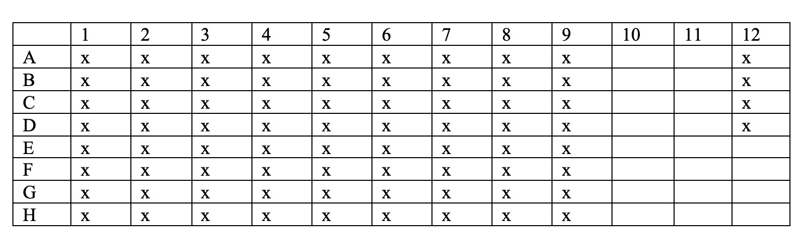
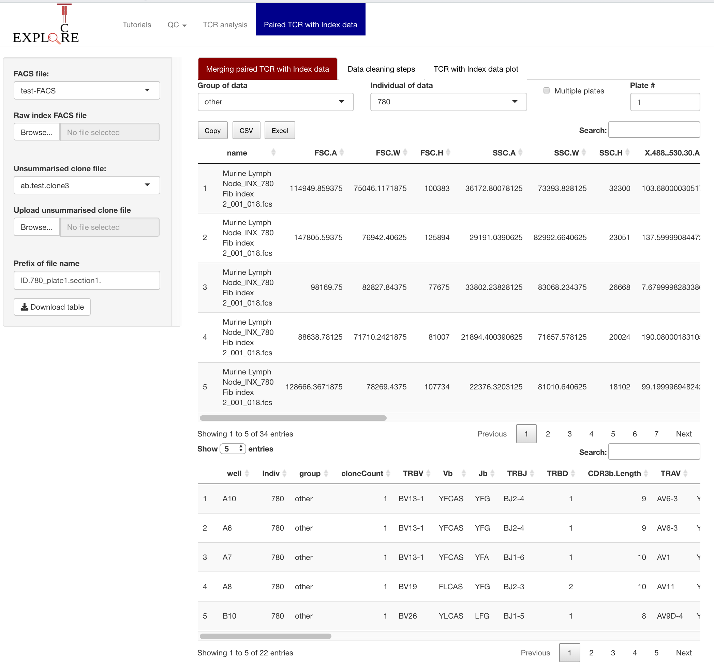
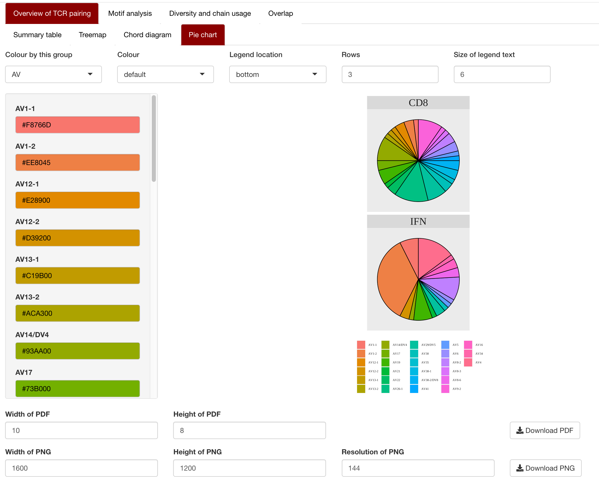
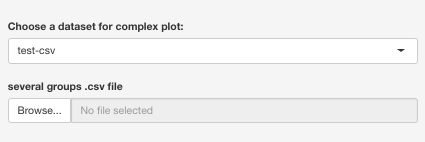
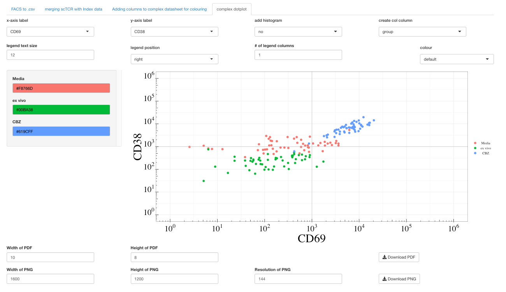

# Single cell TCR data analysis

Please contact: Nicole.Mifsud@monash.edu or Kerry.Mullan@monash.edu to report errors.

### Upload the FACS file and unsummarised clone file

The first tab is used to merge the paired TCR file with the .fcs FACS file. 

The user needs to type into the "Group of data" and "Individual of data" the group and individual. There is also the option to specify if multiple plates were used. 

The merged file is based on a 80 well sorted plate (A1-H10). Columns 11 and 12 are not included, which is based on the experimental setup. 

### Data cleaning steps

upload the merged index pairied TCR data file. 

Things to do before uploading the file 
- rename headers as desired (i.e. CD69 APC)
- Headers can only contain characters or number (no special characters)

Recommended selecting for ab TCR data: Indiv, group,TRBV,CDR3b.Sequence, TRBJ, TRAV, CDR3a.Sequence, TRAJ, AJ, BJ and AJBJ. Do not select flurochrome columns, cloneCount 

Creating the files
- select the gene column and corresponding CDR3 column (repeat for both chains)
- Select the # of clones cut-off i.e. >1 clone or 0 for all clones
- Download the file

Note: I would recommend leaving the clonal filter at 1. I would then copy these columns in excel followed by removing unwanted clones rather than having to redo this step. 

### The dot plot of selected clones

Upload the colour file

Select the following:
- x-axis column
- y-axis column
- adding in a histogram
- Column to colour by 
- size, location and number of columns for the legend
    + If using histograms, place legend below or to the left
- Type of colouring scheme: Default, random or grey
    + all colours can be altered
- download as either a .png or PDF

