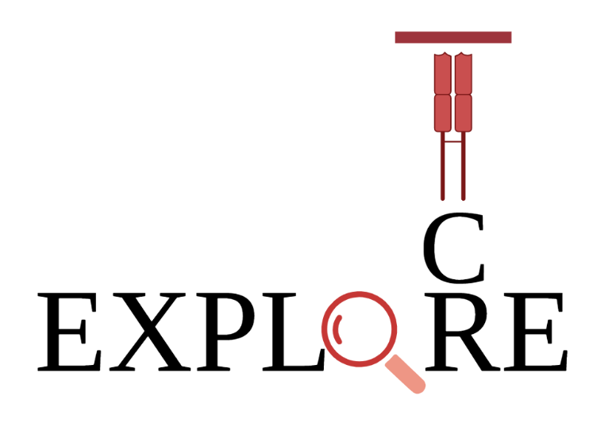

### TCR_Explore Shiny R application

TCR_Explore was designed as an open-access web server that analyses and visualises TCR repertoire data without the need for coding expertise. TCR_Explore introduces multiple pipelines using an automated process that includes pairing of αβ or γδ chains, as well as facilitating interrogation of linked flow cytometric index data for immunophenotyping analyses. Additionally, automated summarisation process from a single input file enables the creation of a variety of publication-ready analytical plots. 

There are three main sections:
- Quality control (QC) processes
 + Uses output files generated from IMGT^1
 + Workflow → QC tab
 + Creates a universal input file for TCR repertoire data analysis
 + Tutorial video available
- TCR analysis 
    + User uploads the paired file generated from TCR_Explore QC process
    + Several analytical graph features available including Treemap, Chord diagram, Pie chart, Motif analysis, Diversity and chain usage, and Overlap for comparison of multiple datasets (Heatmap and Upset plots)
    + For more information on the functions, see the TCR analysis information tab
- Paired TCR with Index data 
    + User uploads the paired file generated from TCR_Explore QC process and a corresponding .fcs (FACS index data) file
    + The merged file undergoes further QC process in the 'data cleaning steps'
        1. Changes the flow cytometric values from negative to small positive 
        2. User can filter using the clone count for coloring purposes (0=all values included)
    + This clean file is then used to create the dotplot, which has over 20 customisable features
    + For more information on the functions, see Paired TCR with Index data information tab

Please contact: Kerry.Mullan1@monash.edu or Nicole.Mifsud@monash.edu to report errors.

Biomedicine Discovery Institute and Department of Biochemistry and Molecular Biology, Monash University, Melbourne, VIC 3800, Australia


##### Citation:

1. Mullan KA, Zhang JB, Jones CM, Goh SJR, Revote J, Illing PT, Purcell AW, La Gruta NL, Li C, Mifsud NA. TCR_Explore: A novel webtool for T cell receptor repertoire analysis. Comput Struct Biotechnol J. 2023 Feb 3;21:1272-1282. doi: 10.1016/j.csbj.2023.01.046. PMID: 36814721; PMCID: PMC9939424.

[paper](https://www.sciencedirect.com/science/article/pii/S2001037023000466)

##### References:
1.	Lefranc MP, Giudicelli V, Duroux P, Jabado-Michaloud J, Folch G, Aouinti S, et al. IMGT(R), the international ImMunoGeneTics information system(R) 25 years on. Nucleic Acids Res. 2015;43(Database issue):D413-22.

### Local installation

 - Download this github repository 

To use TCR_Explore, first install R, RStudio and other required programs
------------------------------------------------------------------
#### MAC:
* Install [R](https://cran.r-project.org/bin/macosx/)
* Install RStudio [Version 2022.07.2-576](https://s3.amazonaws.com/rstudio-ide-build/desktop/macos/RStudio-2022.07.2-576.dmg), as later version have an issue with opening RShiny in the window.
* Install [XQuatz](https://www.xquartz.org)

#### Windows:
* Install [R](https://cran.r-project.org)
* Install [RStudio](https://posit.co/download/rstudio-desktop/)
* Install [Rtools](https://cran.r-project.org/bin/windows/Rtools/)


### installing the packages.

**Step 1.** open the TCR_Explore.Rproj file

**Step 2.** open the install.packages.TCR_Explore.R file

**Step 3.** Run each line (top right)

- short-cut key
  + Mac: Command-shift-n
  + Windows: ctrl-shift-n

**Possible installing prompts**

When you see this line: "These packages have more recent versions available. It is recommended to update all of them. Which would you like to update? Enter one or more numbers, or an empty line to skip updates:", answer with  **1** and hit **Enter**.

On a **Mac** if you see "Do you want to install from sources the package which needs compilation? (Yes/no/cancel)", answer with  **no** and hit **Enter**. *This same message will appear as an popup on Windows.*

Once all packages are installed, this will be the final section of the installation process. 
```
* installing *source* package ‘TCR_explore.R’ ...
** using staged installation
** R
** inst
** byte-compile and prepare package for lazy loading
** help
*** installing help indices
*** copying figures
** building package indices
** testing if installed package can be loaded from temporary location
** testing if installed package can be loaded from final location
** testing if installed package keeps a record of temporary installation path
* DONE (TCR_explore.R)
```

**Step 4.** open the TCR_Explore_v1.0.R and hit RunApp (top-right corner)
