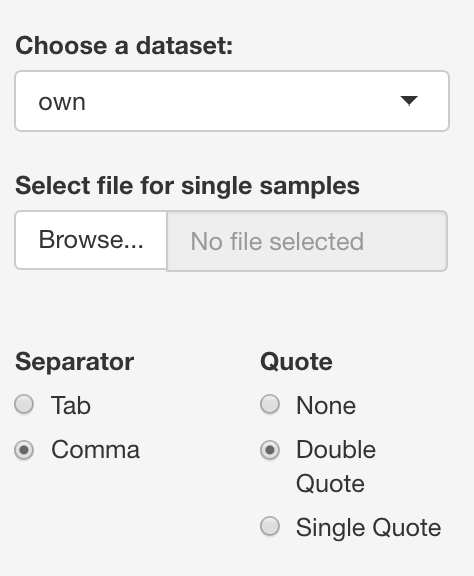
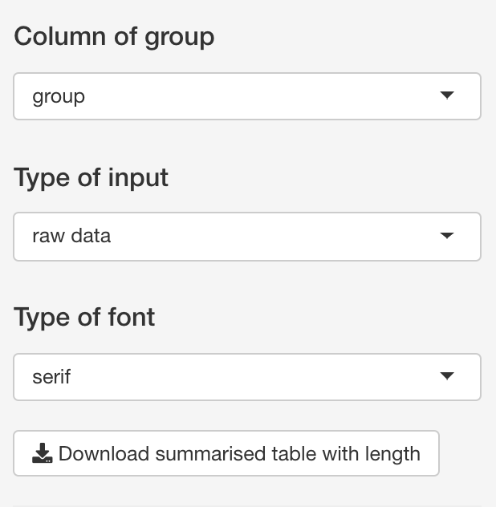
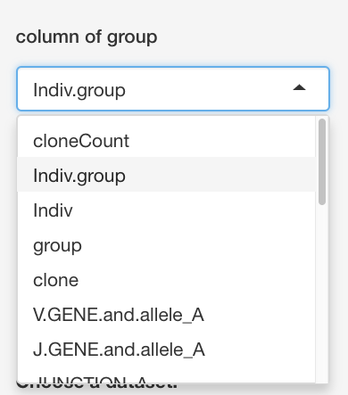
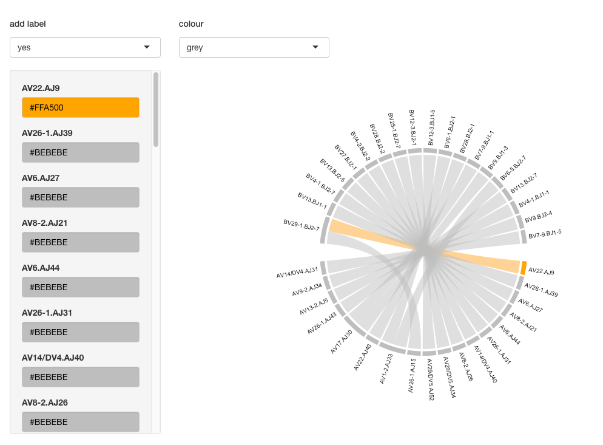
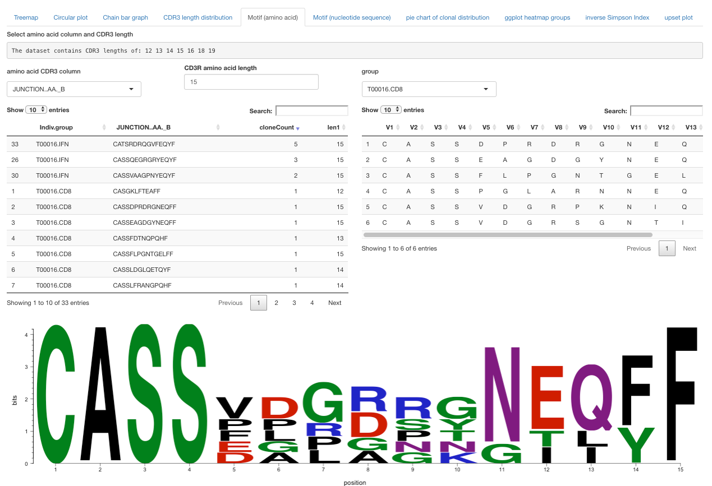

# TCR repertiore analysis

Please contact: Nicole.Mifsud@monash.edu or Kerry.Mullan@monash.edu to report errors.

## upload the file

### Side panel. 
Upload the file. This can be from our QC section or alternative sources. 
The other features in the side panel are 
- 'Type of group'
  + This is used to change the comparison. We recommend either using "group","indiv" or "group.indiv". 
- 'Type of data'
  + This segregates out if the original file was 'raw' or 'summarized'
- 'Type of font' 
  + Specify the font for the figures. the R default fonts are serif, sans and mono. Additional fonts were found on https://fonts.google.com? (email Kerry if there is a specific font you would like to use.)

#### other feature of side panel

the 'column of group' will select the group column for circular plot, chain bar graph, CDR3 length distribution and motif graphs

### Treemap tab

The user can specify 
- colour choices include: default, rainbow, random or grey 
    + the colors can then me altered depending on preference
- If they want the labels to appear on the graph
- Column to colour as well as column to separate the panel
- This plot can be downloaded as a PNG or PDF

### Circular plot

The user can 
- select group column i.e. group, indiv or group.indiv
- select the sub-group to display i.e. CD8 or IFN
- colour choices include: rainbow, random or grey 
    + the colours can then me altered depending on preference
- chose if they want labels
- Column to colour as well as column to separate the panel
- This plot can be downloaded as a PNG or PDF

### Motif plots

the nucleotide and amino acid plots show the unique sequences of a certain length

