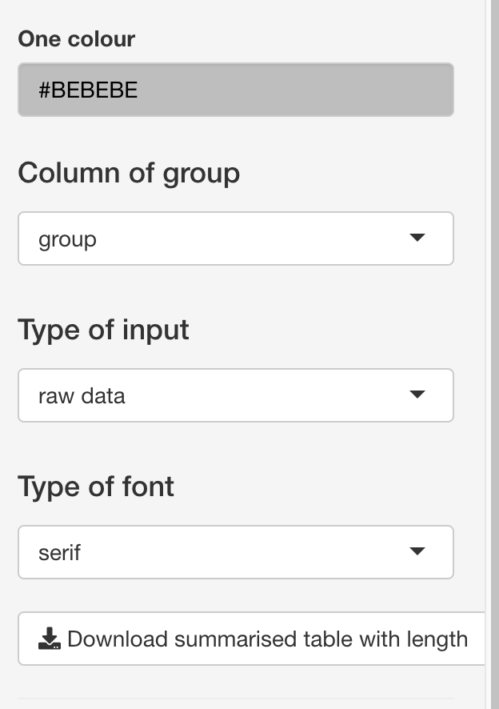
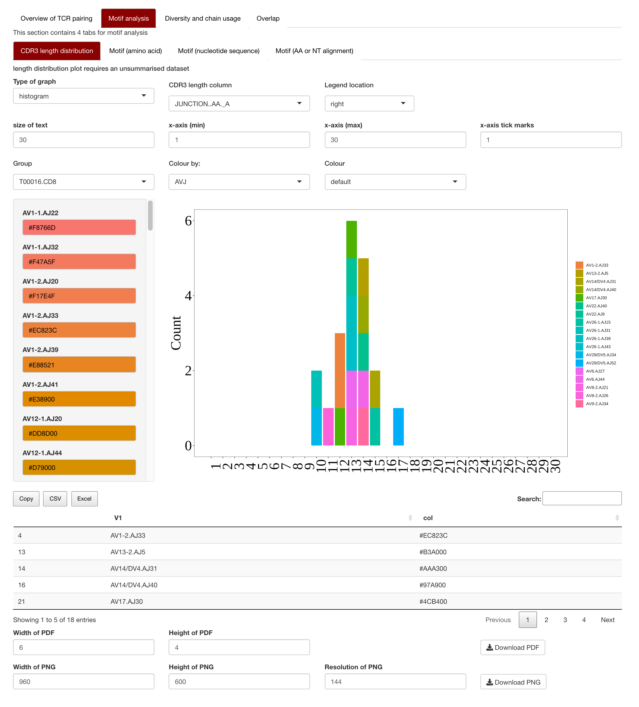

# TCR repertoire analysis

<a href="#TCR analysis section">TCR analysis section</a> 
<a href="#Motif analysis section">Motif analysis section</a> 
<a href="#Diversity and chain interrogation">Diversity and chain interrogation</a> 
<a href="#Group overlap analysis">Group overlap analysis</a>

## Side panel.
Upload the file. This can be from our QC section or alternative sources. 
The other features in the side panel are 
- 'Type of group'
  + This is used to change the comparison. We recommend either using "group","indiv" or "group.indiv". 
- 'Type of data'
  + This segregates out if the original file was 'raw' or 'summarized'
- 'Type of font' 
  + Specify the font for the figures. the R default fonts are serif, sans and mono. Additional fonts were found on https://fonts.google.com (email Kerry if there is a specific font you would like to use.)

## TCR analysis section
<a href="#summary table">summary table</a> 
<a href="#Treemap">Treemap</a> 
<a href="#Chord diargram">Chord diargram</a> 
<a href="#Pie chart">Pie chart</a> 

### Overview of TCR pairing

#### summary table

The user can specify the type of summary table to download. 

They can either select their own columns (general summary) or downlaod as TCRdist3 .csv output.

For the TCRdist3, there is a need to use our QC process as it matches the IMGT column names. 

There is also a need to select if the input data is either alpha-beta (ab) or gamma-delta (gd) for the TCRdist3 column selection.

<a href="#TCR analysis section">TCR analysis section</a> 
<a href="#TCR repertoire analysis">Go to top</a> 

#### Treemap
The user can specify: 
- The order of the group (i.e. CD8 and IFNg)
- colour choices include: default, rainbow, random or one colour (specified in side panel) 
    + The colour can be altered afterwards
- If they want the labels to appear on the graph
- Column to colour as well as column to separate the panel
- This plot can be downloaded as a PNG or PDF

<a href="#TCR analysis section">TCR analysis section</a> 
<a href="#TCR repertoire analysis">Go to top</a> 

#### Chord diargram

There are several features the user can specify:
- Sub-group to display
- The user can select the two columns used to display in the chord diagram
- The transparency of the 'Label' and 'no label' is for the entire data set
- There is also an option to selectively label one or more, where the transparency and lines can be added
- Colour choices: default, rainbow, random or one colour (specified in side panel) 
- Labels can be added or removed if needed 
- Legend is not displayed for any of the graphs
- This plot can be downloaded as a PNG or PDF

<a href="#TCR analysis section">TCR analysis section</a> 
<a href="#TCR repertoire analysis">Go to top</a> 

#### Pie chart
There are several features the user can specify:
- Displays one chain
- The user can alter what is displayed as either: group or indiv.group
- The amount of rows can be specified
- The legend location can be altered as well as the size of the text
- Colour choices: default, random or one colour (specified in side panel) 
- This plot can be downloaded as a PNG or PDF

<a href="#TCR analysis section">TCR analysis section</a> 
<a href="#TCR repertoire analysis">Go to top</a> 

### Motif analysis section

<a href="#CDR3 length distribution">CDR3 length distribution</a> 
<a href="#Single length motif analysis">Single length motif analysis</a> 
<a href="#Aligned motif analysis">Aligned motif analysis</a> 

#### CDR3 length distribution
The length distribution presented is by the unique CDR3 sequences.

The user can specify:
- the type of graph
  + histogram, which can be coloured by specific chains (i.e. Colour by: AVJ)
  + Density plot, coloured by Column of group (side panel)
- The CDR3 sequences (amino acid or nucleotide)
- The size of the text
- x-axis range (default 1 to 30) and tick mark interval
- The user can also download the summarised table with the lengths or colours that were used 
- This plot can be downloaded as a PNG or PDF

<a href="#Motif analysis section">Motif analysis section</a> 
<a href="#TCR repertoire analysis">Go to top</a> 

#### Single length motif analysis

The nucleotide and amino acid plots show the unique sequences of a certain length

these are displayed as 'Motif (amino acid)' and 'Motif (nucleotide)'

<a href="#Motif analysis section">Motif analysis section</a> 
<a href="#TCR repertoire analysis">Go to top</a> 

#### Aligned motif analysis

<a href="#Motif analysis section">Motif analysis section</a> 
<a href="#TCR repertoire analysis">Go to top</a> 

### Diversity and chain interrogation

<a href="#TCR analysis section">TCR analysis section</a> 
<a href="#TCR repertiore analysis">Go to top</a> 

### Group overlap analysis

<a href="#TCR analysis section">TCR analysis section</a> 
<a href="#TCR repertiore analysis">Go to top</a> 
